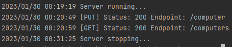

# pc-store
CRUD server providing the computer store API

### Run server
```
 go build ./cmd/server
```
```
./server
```

### API

---

+ **GET /computers**

***Response:*** `200 OK`
```json
[{"id":1,"name":"Pro gaming ASUS","cpu":"Core i3-10100f","videocard":"RTX 2060s",
  "ram":16,"data_storage":"hdd 1tb","added_at":"2023-01-29T17:04:05.024044Z","price":17999}, 
 {"id":2,"name":"Basic office PC","cpu":"Pentium n5000","ram":8, 
  "data_storage":"hdd 512mb","added_at":"2023-01-30T00:20:49.635803Z","price":6999}]
```

---

+ **PUT /computer**  

***Request body:***
```json
{"name":"Pro gaming ASUS","cpu":"Core i3-10100f","videocard":"RTX 2060s",
  "ram":16,"data_storage":"hdd 1tb","price":17999}
```

***Response:*** `200 OK`  
Return `400 Bad Request` if the request body contains error.

---

+ **GET /computer/{id}**  
 
***Response:*** `200 OK`
```json
{"id":1,"name":"Pro gaming ASUS","cpu":"Core i3-10100f","videocard":"RTX 2060s",
  "ram":16,"data_storage":"hdd 1tb","added_at":"2023-01-29T16:38:50.550613Z","price":17999}
```
Return `404 Not Found` if there is no record with this `id`.  

---

+ **POST /computer/{id}**

***Request body:***
```json
{"name":"Pro gaming PC","data_storage":"ssd 512tb"}
```

***Response:*** `200 OK`  
Return `400 Bad Request` if the request body contains error.   
Return `404 Not Found` if there is no record with this `id`.

---

+ **DELETE /computer/{id}**

***Response:*** `200 OK`  
Return `404 Not Found` if there is no record with this `id`.

---

### Server example
```go
package main

import (
	"context"
	"github.com/ninja-way/pc-store/internal/middleware"
	"github.com/ninja-way/pc-store/internal/repository/postgres"
	"github.com/ninja-way/pc-store/internal/server"
	"log"
	"net/http"
)

func main() {
	ctx := context.Background()

	// connect to database
	db, err := postgres.Init(ctx)
	if err != nil {
		log.Fatal(err)
	}

	// setup server with logging
	s := server.New(":8080", middleware.Logging(http.DefaultServeMux), db)

	// start server
	if err = s.Run(); err != nil {
		log.Fatal(err)
	}
}
```
